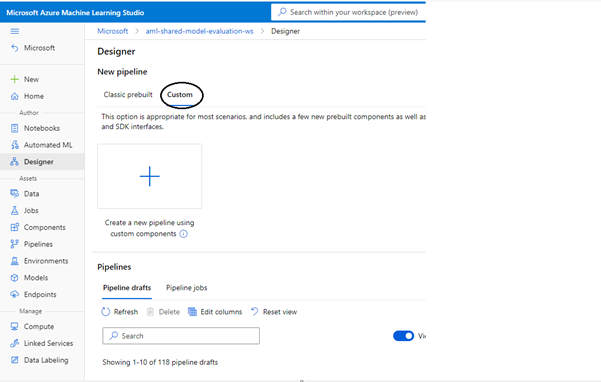
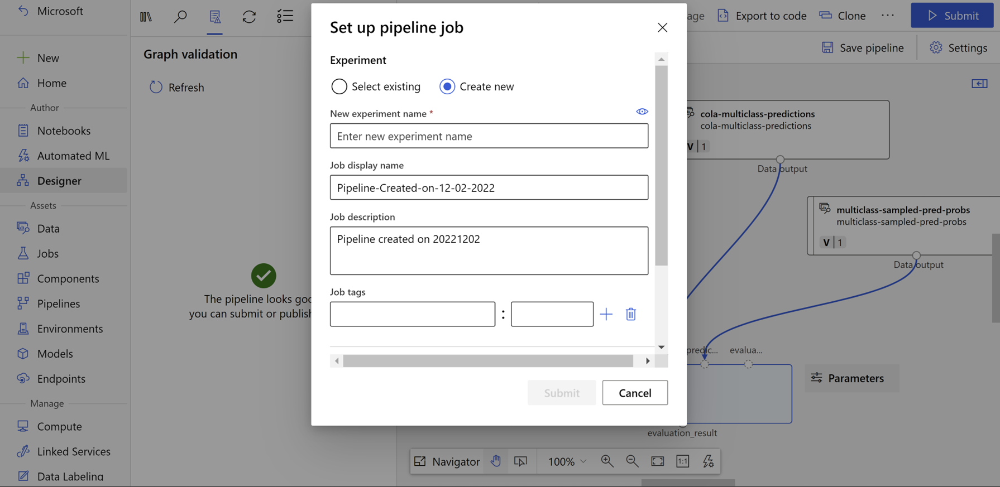
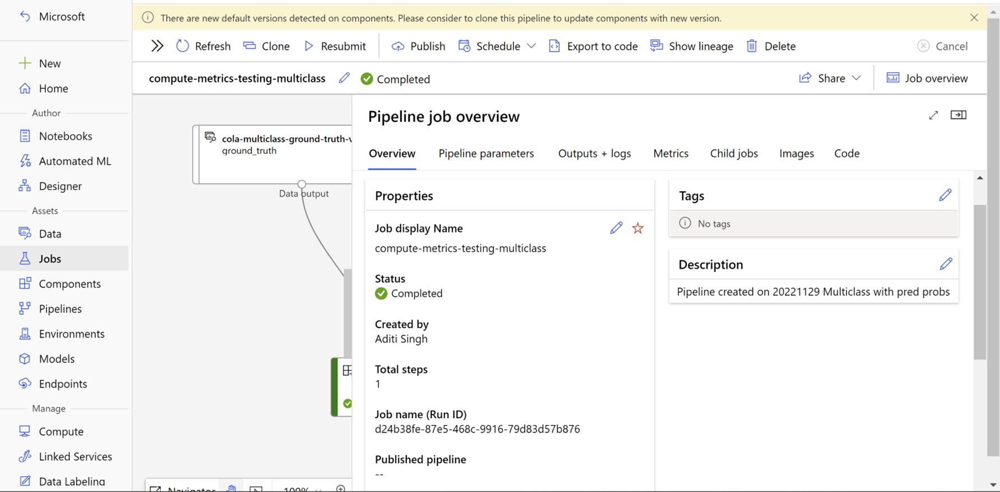

# Compute Metrics Component
This component enables user to evaluate a model by providing generated predictions and true values to return generated metrics. (Scores the predictions provided by user. No model is required in this case).

### Supported Tasks
- Tabular classification (binary/multiclass)
- Tabular classification multilabel
- Tabular Regression
- Text Classification (binary/multiclass)
- Text Classification multilabel
- Text Regression
- Text Summarization
- Text Translation
- Text Question Answering
- Text Named Entity Recognition

### Designer
- Step 1: Go to Designer  
- Step 2: Select Custom and click on Create a new pipeline with custom components. 
- Step 3: Search for "Compute Metrics" in Component section and drag-and-drop the component to designer section 
- Step 4: Drag-and-drop your ground_truth, predictions, prediction_probabilities (optional) and evaluation Config data (optional depending on the component) from data section to designer. Connect the respective data assets to the input ports. 
- Step 5: Double click on the "Compute Metrics" Component and fill out the task type 
- Step 6: Select a compute from "Run Settings". 
- Step 7: Submit the pipeline. 

### SDK V2
(Pre-requisites: Install v2 sdk using – `pip install azure-ai-ml`) 

Compute Metrics Job can be created by user by consuming our component under a pipeline job. Our component can be a part of another pipeline or a standalone job as well. 

### Azure ML CLI (V2) 
Compute Metrics job can also be created using Azure ML CLI. The user must create a pipeline job YAML with component as `azureml:compute_metrics:` and specify all other input parameters including Test data which is passed as `URI_FOLDER`. 

### Inputs
1. _task_ (string, required):

    Task type for which model is trained
2. _ground_truths_ (URI_FILE, optional):

    Actual ground truth to evaluate predictions against. The file should be of JSON lines format containing only one key.
3. _ground_truths_mltable (mltable, optional):

    Ground truths in the form of mltable
4. _predictions_ (URI_FILE, optional):

    Actual predictions which are to be evaluated. They should be in json lines too with only one key.
5. _predictions_mltable_ (mltable, optional):
    
    Predictions in the form of mltable
6. _prediction_probabilities_ (URI_FILE, optional):

    User can pass prediction probabilities as well in order to calculate better set of metrics for classification tasks. This file should be in JSON lines format as well with number of keys equals to number of unique labels.

7. _prediction_probabilities_probabilities_ (mltable, optional):

    Prediction probabilities as mltable
8. _ground_truths_column_names_ (string, optional):

    Column name which contains ground truths in provided uri file for ground_truths.
9. _predictions_column_name_ (string, optional):

    Column name which contains predictions in provided uri file for predictions.
10. _evaluation_config_ (URI_FILE, optional):

    Additional config file required by metrics package. This data asset should contain a JSON Config file. [Samples](#sample-of-evaluation-config-file)

### Results
After submitting the job, you’ll be able to see the Job in your Machine Learning Studio like this:

### Outputs
1. _evaluationResult_ (URI_FOLDER):

    Path to output directory which contains the generated artifacts_metadata.json file containing all the non-scalar metrics, metrics.json containing all the scalar metrics and artifacts folder containing other metadata available.
    
    

    1. _metrics.json_ (URI_FILE):
        
       It is a single level Json containing all the scalar metrics calculated during evaluation.
    
       Sample: [metrics.json](../../docs/sample_outputs/metrics.json)
   2. _artifacts_metadata.json_ (URI_FILE):
   
      It is a two-level Json containing all the non-scalar metrics with value as name of the `EvaluationArtifact` file stored inside the “artifacts” folder. 
      
      Sample: [artifacts_metadata.json](../../docs/sample_outputs/artifacts_metadata.json)
   3. _artifacts folder_ (URI_FOLDER):
   
      Artifacts folder contains all the `EvaluationArtifact` created during mlflow.evaluate call. To keep it in-line with our current approach we have used `JsonEvaluationArtifact` only. 
   
      Sample: [confusion_matrix.json](../../docs/sample_outputs/confusion_matrix.json)

### Sample of evaluation config file
- For Classification Scenario: [multiclass-config](../../docs/sample_configs/multiclass-config.json)
- For Multilabel Classification Scenario: [multilabel-config](../../docs/sample_configs/multilabel-config.json)
- For Text NER Scenario: [ner-config](../../docs/sample_configs/ner-config.json)
- For Summarization Scenario: [summarization-config](../../docs/sample_configs/summarization-config.json)
- For Translation Scenario: [translation-config](../../docs/sample_configs/translation-config.json)
- For Question-Answering Scenario: [qna-config](../../docs/sample_configs/qna-config.json)