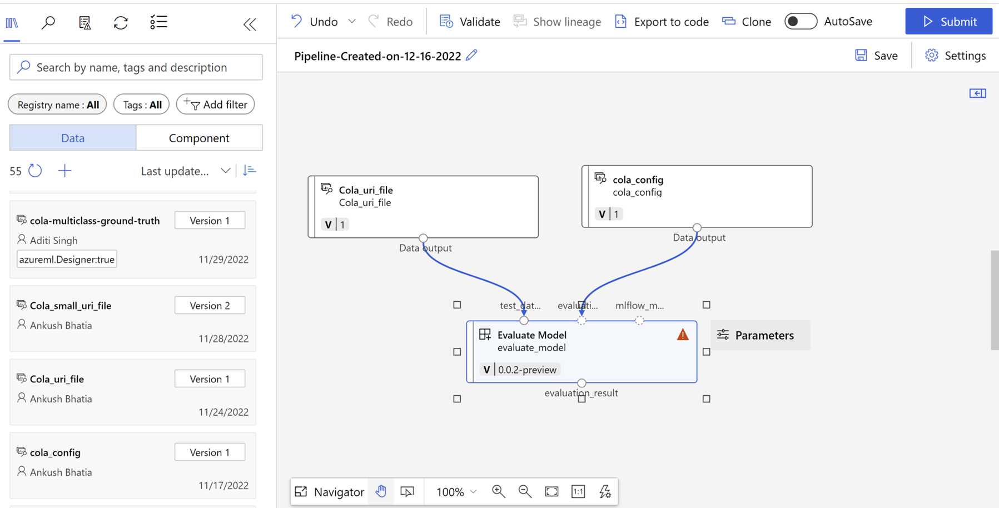
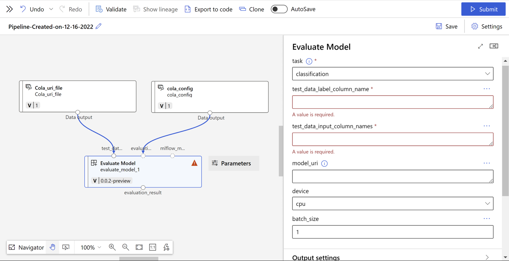
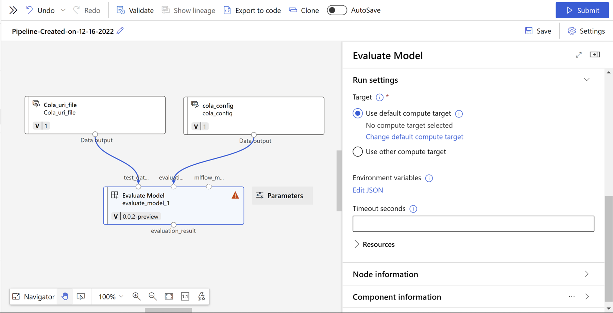
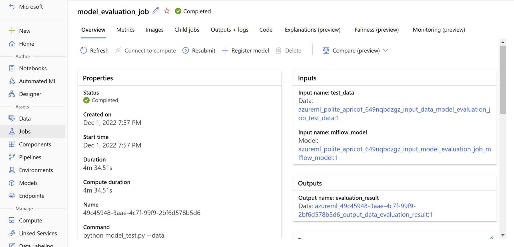

# Evaluate Model Component
This component enables user to evaluate a model by providing the supported model, run inference to generate predictions first followed by computing metrics against a dataset. You can find the component in your workspace components page.

### Supported Tasks
- Tabular classification (binary/multiclass)
- Tabular classification multilabel
- Tabular Regression
- Text Classification (binary/multiclass)
- Text Classification multilabel
- Text Regression
- Text Summarization
- Text Translation
- Text Question Answering
- Text Named Entity Recognition

### Designer
- Step 1: Go to Designer  
- Step 2: Select Custom and click on Create a new pipeline with custom components. 
- Step 3: Search for "Evaluate Model" in Component section and drag-and-drop the component to designer section 
- Step 4: Drag-and-drop Your Test Data set and Evaluation Config data (Optional depending on the component) from data section to designer. Connect your test data to test_data input of component and your config data to evaluation_config input of component 
- Step 5: Double click on the "Evaluate Model" Component and fill out rest of the inputs 
- Step 6: Select a compute from "Run Settings" 
- Step 7: Submit the pipeline. 

### SDK V2
(Pre-requisites: Install v2 sdk using – `pip install azure-ai-ml`) 

Model Evaluation Job can be created by user by consuming our component under a pipeline job. Our component can be a part of another pipeline or a standalone job as well. 

### Azure ML CLI (V2) 
Model evaluation job can also be created using Azure ML CLI. A User has to create a Pipeline job YAML with component as `azureml:evaluate_model:` and specify all other input parameters including Test data which is passed as `URI_FOLDER`. 

### Inputs
1. _task_ (string, required):

    Task type for which model is trained
2. _test_data_ (URI_FILE, required):

    Path to file containing test data in `jsonl` format
    
3. _test_data_mltable_ (mltable, optional):
    
    Test data in the form of mltables

4. _evaluation_config_ (URI_FILE, optional):

    Additional config file required by metrics package. This data asset should contain a JSON Config file. [Samples](#sample-of-evaluation-config-file)
5. _test_data_input_column_names_ (string, required):

    Name of the columns in the test dataset that should be used for prediction. More than one columns should be separated by the comma(,) delimiter without any whitespaces in between
6. _test_data_label_column_name_ (string, required):

    Name of the key containing target values in test data.
7. _mlflow_model_ (mlflow_model, optional):

    MLFlow model (either registered or output of another job)
8. _model_uri_ (string, optional):

    MLFlow model uri of the form -  
    fetched from azureml run as `runs:/<azureml_run_id>/run-relative/path/to/model`  
    fetched from azureml model registry as `models:/<model_name>/<model_version>`
9. _device_ (string, optional):
    
    Option to run the experiment on CPU or GPU provided that the compute that they are choosing has Cuda support.
10. _batch_size_ (integer, optional):

    Option to run the experiment on batch support.
### Results
After submitting the job, you’ll be able to see the Job in your Machine Learning Studio like this:

### Outputs

1. _predictions_ (URI_FILE):

    A csv file called “predictions.csv” which contains predictions stored in a column named “predictions” with the original formatting intact. 
2. _evaluationResult_ (URI_FOLDER):

    Path to output directory which contains the generated predictions.csv file containing predictions for the provided test set to the component and other metadata in the evaluationResult folder. This can be directly used by any other job in pipeline.
    Output of a mlflow.evaluate job is an `mlflow.models.evaluation.base.EvaluationResult` object (see [link](https://github.com/mlflow/mlflow/blob/master/mlflow/models/evaluation/base.py#L210)) which has two attributes viz. metrics and artifacts. 

    

    We save the EvaluationResult object via “mlflow.models.evaluation.base.EvaluationResult.save()” API (see [link](https://github.com/mlflow/mlflow/blob/master/mlflow/models/evaluation/base.py#L244)), which creates 2 JSON files and multiple [EvaluationArtifact](https://github.com/mlflow/mlflow/blob/master/mlflow/models/evaluation/base.py#L210) files.
    1. _metrics.json_ (URI_FILE):
        
       It is a single level Json containing all the scalar metrics calculated during evaluation.
    
       Sample: [metrics.json](../../docs/sample_outputs/metrics.json)
   2. _artifacts_metadata.json_ (URI_FILE):
   
      It is a two-level Json containing all the non-scalar metrics with value as name of the `EvaluationArtifact` file stored inside the “artifacts” folder. 
      
      Sample: [artifacts_metadata.json](../../docs/sample_outputs/artifacts_metadata.json)
   3. _artifacts folder_ (URI_FOLDER):
   
      Artifacts folder contains all the `EvaluationArtifact` created during mlflow.evaluate call. To keep it in-line with our current approach we have used `JsonEvaluationArtifact` only. 

### Sample of evaluation config file
- For Classification Scenario: [multiclass-config](../../docs/sample_configs/multiclass-config.json)
- For Multilabel Classification Scenario: [multilabel-config](../../docs/sample_configs/multilabel-config.json)
- For Text NER Scenario: [ner-config](../../docs/sample_configs/ner-config.json)
- For Summarization Scenario: [summarization-config](../../docs/sample_configs/summarization-config.json)
- For Translation Scenario: [translation-config](../../docs/sample_configs/translation-config.json)
- For Question-Answering Scenario: [qna-config](../../docs/sample_configs/qna-config.json)

### Additional Parameters
- Classification Inputs
    1. _metrics_ (list[str], optional): 

        List of metric names to be computed. If not provided we choose the default set. 
    2. _class_labels_ (list[any], optional): 

        List of labels for entire data (all the data train/test/validation) 
    3. _train_labels_ (list[any], optional): 

        List of labels used during training. 
    4. _sample_weight_ (list[float], optional):  
        Weights for the samples (Does not need to match sample weights on the fitted model) 
    5. _use_binary_ (bool, optional): 

        Boolean argument on whether to use binary classification metrics or not 
    6. _positive_label_ (any, optional):

        Class designed as positive class in binary classification metrics. 
    7. _multilabel_ (bool, optional): 
    
        Whether the classification type is multilabel or single label.

- Regression Inputs
    1. _metrics_ (list[str], optional): 

        List of metric names to be computed. If not provided we choose the default set. 
    2. _y_max_ (float, optional): 

        The max target value. 
    3. _y_min_ (float, optional): 

        The min target value. 
    4. _y_std_ (float, optional): 

        The standard deviation of targets value. 
    5. _sample_weight_ (list[float], optional):

        Weights for the samples (Does not need to match sample weights on the fitted model) 
    6. _bin_info_ (dict[str, float], optional):  

        The binning information for true values. This should be calculated from make_dataset_bins. Required for 
        calculating non-scalar metrics. 

- Token Classification Inputs
    1. _train_label_list_ (list[str], optional)

        List of labels for training data.
    2. _metrics_ (list[str], optional)

        List of metric names to be computed. If not provided we choose the default set. 

- Summarization Inputs
    1. _metrics_ (list[str], optional)

        List of metric names to be computed. If not provided we choose the default set. 
    2. _aggregator_ (bool, optional)

        Boolean to indicate whether to aggregate scores.
    3. _stemmer_ (bool, optional)

         Boolean to indicate whether to use Porter stemmer for word suffixes.

- Translation Inputs
    1. _metrics_ (list[str], optional)

        List of metric names to be computed. If not provided we choose the default set. 
    2. _smoothing_ (bool, optional)

        Boolean to indicate whether to smooth out the bleu score

- Question Answering Inputs
    1. _metrics_ (list[str], optional)

        List of metric names to be computed. If not provided we choose the default set. 
    2. _regexes_to_ignore_ (list[str], optional)

        List of string regular expressions to ignore.
    3. _ignore_case_ (bool, optional)

         Boolean to indicate whether to ignore case.
    4. _ignore_punctuation_ (bool, optional)

         Boolean to indicate whether to ignore punctuation.
    5. _ignore_numbers_ (bool, optional)

         Boolean to indicate whether to ignore numbers.