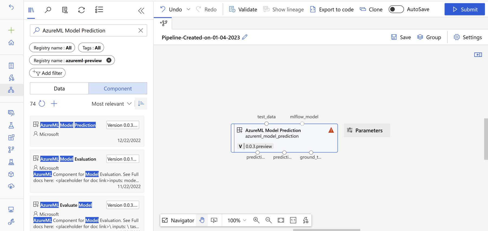
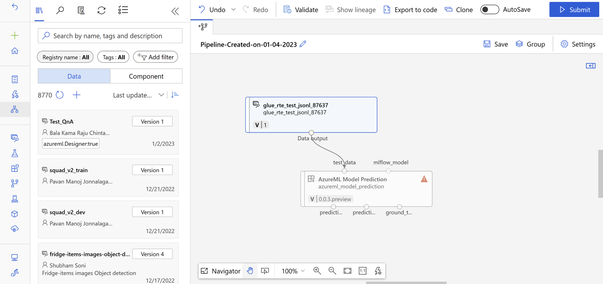
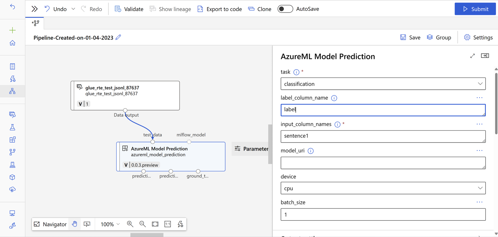
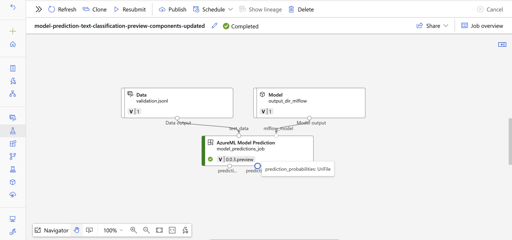
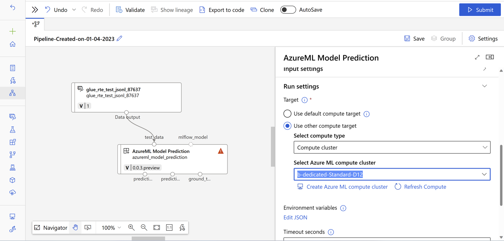

# Model Prediction Component
This component which enables user to generate predictions on a given model.

### Supported Tasks
- Tabular classification (binary/multiclass)
- Tabular classification multilabel
- Tabular Regression
- Text Classification (binary/multiclass)
- Text Classification multilabel
- Text Regression
- Text Summarization
- Text Translation
- Text Question Answering
- Text Named Entity Recognition

### Designer
- Step 1: Go to Designer  
- Step 2: Select Custom and click on Create a new pipeline with custom components. 
- Step 3: Add a filter to search in "azureml-preview" registry and search for "AzureML Model Prediction" in Component section and drag-and-drop the component to designer section 
- Step 4: Drag-and-drop Your Test Data set from data section to designer. Connect your test data to test_data input of component. 
- Step 5: Double click on the "AzureML Model Prediction" Component and fill out rest of the inputs based on task type and dataset. 
- Step 6: Please provide a model_uri in parameters or connect any MLFlow model to mlflow_model input port in "AzureML Model Prediction component". 
- Step 7: Select a compute from "Run Settings" based on value given as cpu or gpu for device parameter. 
- Step 8: Submit the pipeline after providing required details about the experiment. 

### SDK V2
(Pre-requisites: Install v2 sdk using – `pip install azure-ai-ml`) 

Model Evaluation Job can be created by user by consuming our component under a pipeline job. Our component can be a part of another pipeline or a standalone job as well. 

### Azure ML CLI (V2) 
Model evaluation job can also be created using Azure ML CLI. A User has to create a Pipeline job YAML with component as `azureml:model_prediction:` and specify all other input parameters including Test data which is passed as `URI_FOLDER`. 

### Inputs
1. _task_ (string, required):

    Task type for which model is trained
2. _test_data_ (URI_FILE, optional):

    Path to file containing test data in `jsonl` format

3. _test_data_mltable (mltable, optional)

    Test Data MLTable path.

4. _label_column_name_ (string, optional):

    Name of the key containing target values in test data.

5. _input_column_names_ (string, optional):
    
    Input column names in provided test dataset.

6. _mlflow_model_ (mlflow_model, optional):

    MLFlow model (either registered or output of another job)
7. _model_uri_ (string, optional):

    MLFlow model uri of the form -  
    fetched from azureml run as `runs:/<azureml_run_id>/run-relative/path/to/model`  
    fetched from azureml model registry as `models:/<model_name>/<model_version>`
8. _device_ (string, optional):
    
    Option to run the experiment on CPU or GPU provided that the compute that they are choosing has Cuda support.

9. _batch_size_ (int, optional):
    Option to run the experiment on batch support.

### Outputs
1. _predictions_ (URI_FILE):

    Path to output directory which contains the generated predictions.csv file containing predictions for the provided test set to the component and other metadata in the evaluationResult folder

    Sample: [predictions.jsonl](../../docs/sample_outputs/predictions.jsonl)
2. _predictions_mltable_ (mltable):

    Sample: [predictions_mltable](../../docs/sample_outputs/predictions_mltable)
3. _ground_truth_ (URI_FILE):

   Sample: [ground_truth.jsonl](../../docs/sample_outputs/ground_truth.jsonl)

4. _ground_truth_mltable (mltable):

    Sample: [ground_truth_mltable](../../docs/sample_outputs/ground_truth_mltable)

5. _prediction_probabilities_ (URI_FILE):
   
   Sample: [prediction_probabilities.jsonl](../../docs/sample_outputs/prediction_probabilities.jsonl)

6. _prediction_probabilities_ (mltable):

    Sample: [prediction_probabilities_mltable](../../docs/sample_outputs/prediction_probabilities_mltable)
