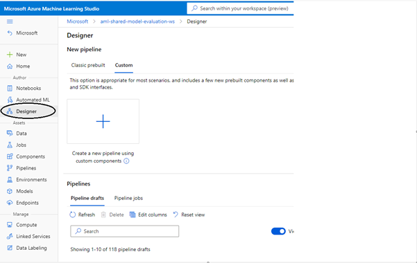
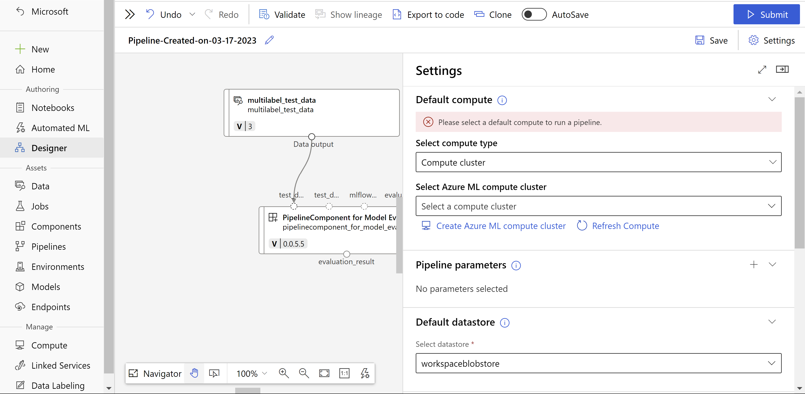

# Model Evaluation Pipeline Component
This pipeline component for model evaluation for supported tasks. Generates predictions on a given model, followed by computing model performance metrics to score the model quality for supported tasks.

### Supported Tasks
- Tabular classification (binary/multiclass)
- Tabular classification multilabel
- Tabular Regression
- Text Classification (binary/multiclass)
- Text Classification multilabel
- Text Regression
- Text Summarization
- Text Translation
- Text Question Answering
- Text Named Entity Recognition

### Designer
- Step 1: Go to Designer  
- Step 2: Select Custom and click on Create a new pipeline with custom components. 
- Step 3: Add a filter to search in "azureml-preview" registry and search for "AzureML Model Prediction" in Component section and drag-and-drop the component to designer section 
- Step 4: Drag-and-drop Your Test Data set from data section to designer. Connect your test data to test_data input of component. 
- Step 5: Double click on the "AzureML Model Prediction" Component and fill out rest of the inputs based on task type and dataset. 
- Step 6: Please provide a model_uri in parameters or connect any MLFlow model to mlflow_model input port in "AzureML Model Prediction component". 
- Step 7: Select a compute from "Run Settings" based on value given as cpu or gpu for device parameter. 
- Step 8: Submit the pipeline after providing required details about the experiment. 

### SDK V2
(Pre-requisites: Install v2 sdk using – `pip install azure-ai-ml`) 

Model Evaluation Pipeline Job can be created by user by consuming our component. Our component can be a part of another pipeline or a standalone job as well. 

### Azure ML CLI (V2) 
Model evaluation job can also be created using Azure ML CLI. A User has to create a Pipeline job YAML with component as `azureml:model_evaluation_pipeline:` and specify all other input parameters including Test data which is passed as `URI_FOLDER`. 

### Inputs
1. _task_ (string, required):

    Task type for which model is trained
2. _test_data_ (URI_FILE, optional):

    Path to file containing test data in `jsonl` format

3. _test_data_mltable_ (mltable, optional):
    
    Test data in the form of mltables

4. _label_column_name_ (string, required):

    Name of the key containing target values in test data.

5. _input_column_names_ (string, optional):
    Input column names in provided test dataset

6. _mlflow_model_ (mlflow_model, optional):

    MLFlow model (either registered or output of another job)

7. _model_uri_ (string, optional):

    MLFlow model uri of the form -  
    fetched from azureml run as `runs:/<azureml_run_id>/run-relative/path/to/model`  
    fetched from azureml model registry as `models:/<model_name>/<model_version>`

8. _ground_truths_column_names_ (string, optional):

    Column name which contains ground truths in provided uri file for ground_truths.

9. _evaluation_config_ (URI_FILE, optional):

    Additional config file required by metrics package. This data asset should contain a JSON Config file. [Samples](../../docs/sample_configs/)

10. _device_ (string, optional):
    
    Option to run the experiment on CPU or GPU provided that the compute that they are choosing has Cuda support.

11. _batch_size_ (int, optional):
    Option to run the experiment on batch support.

### Outputs

1. _evaluationResult_ (URI_FOLDER):

    Path to output directory which contains the generated artifacts_metadata.json file containing all the non-scalar metrics, metrics.json containing all the scalar metrics and artifacts folder containing other metadata available.
     

    1. _metrics.json_ (URI_FILE):
        
       It is a single level Json containing all the scalar metrics calculated during evaluation.
    
       Sample: [metrics.json](../../docs/sample_outputs/metrics.json)
   2. _artifacts_metadata.json_ (URI_FILE):
   
      It is a two-level Json containing all the non-scalar metrics with value as name of the `EvaluationArtifact` file stored inside the “artifacts” folder. 
      
      Sample: [artifacts_metadata.json](../../docs/sample_outputs/artifacts_metadata.json)
   3. _artifacts folder_ (URI_FOLDER):
   
      Artifacts folder contains all the `EvaluationArtifact` created during mlflow.evaluate call. To keep it in-line with our current approach we have used `JsonEvaluationArtifact` only. 
   
      Sample: [confusion_matrix.json](../../docs/sample_outputs/confusion_matrix.json)

### Sample of evaluation config file
- For Classification Scenario: [multiclass-config](../../docs/sample_configs/multiclass-config.json)
- For Multilabel Classification Scenario: [multilabel-config](../../docs/sample_configs/multilabel-config.json)
- For Text NER Scenario: [ner-config](../../docs/sample_configs/ner-config.json)
- For Summarization Scenario: [summarization-config](../../docs/sample_configs/summarization-config.json)
- For Translation Scenario: [translation-config](../../docs/sample_configs/translation-config.json)
- For Question-Answering Scenario: [qna-config](../../docs/sample_configs/qna-config.json)
